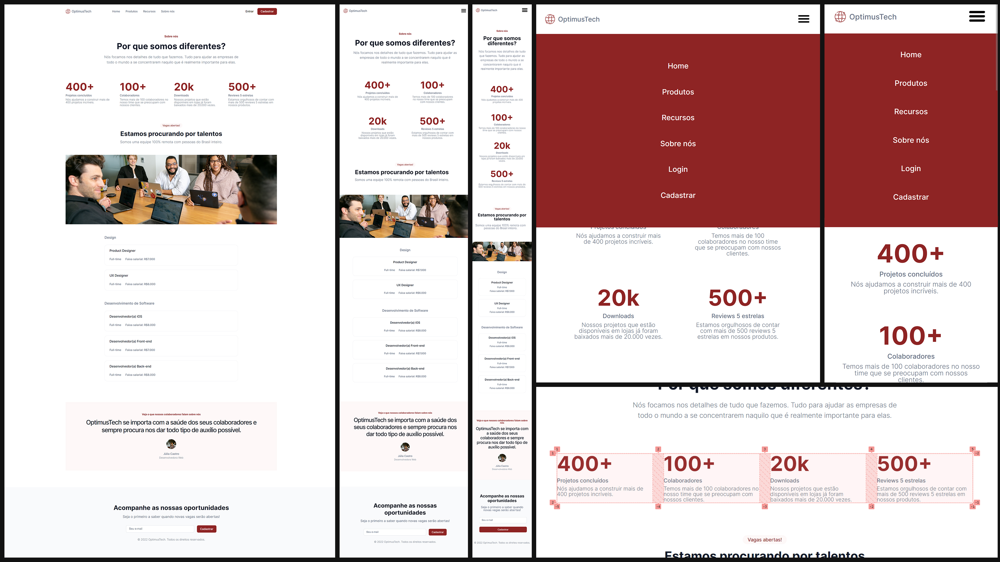

[**OPTIMUS TECH**]()

##

**ABOUT OPTIMUS TECH**

- The "Optimus Tech" landing page was a "[7 days of Code](https://7daysofcode.io/matricula/html-css)" challenge by Giovanna Moeller and it is part of the course "A partir do zero: HTML e CSS para projetos web" from Alura;
- The goal was to practice HTML & CSS and have an experience of a real life front-end project development;
- We received a Figma file of the design of the landing page where we extracted all the details of the project;

##

**OBERVATIONS**

- After finishing the project I decided to make the page responsive by using media queries. This was not part of the challenge but I wanted to learn and practice to develop a responsive webpage.
- I practiced to use "variables" to make the css code easy to edit/customize;
- I used CSS Grid & Flexbox to position the elements throughout the page and to adpat the layout using media queries;
- [About Alura](https://www.alura.com.br);
